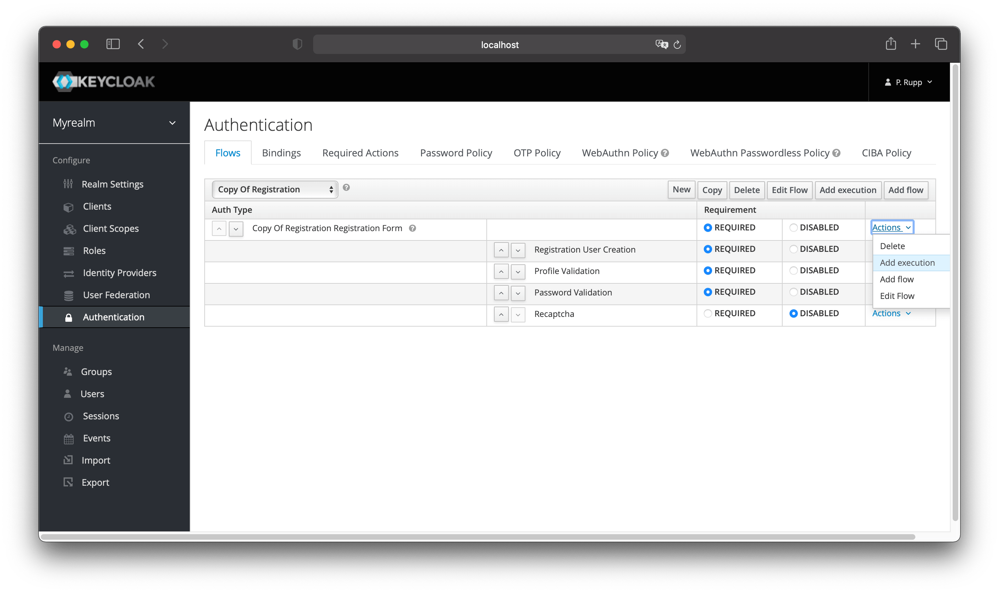
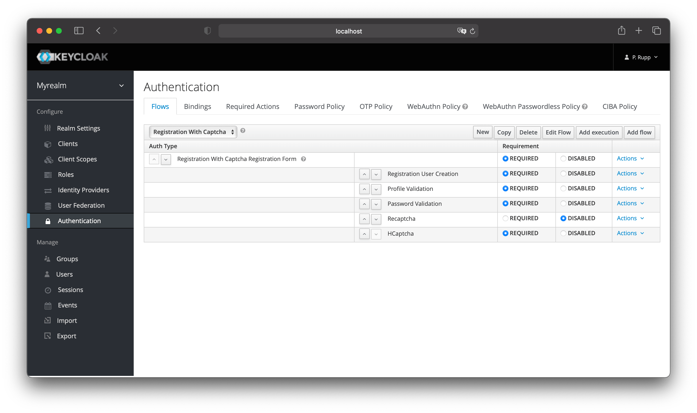
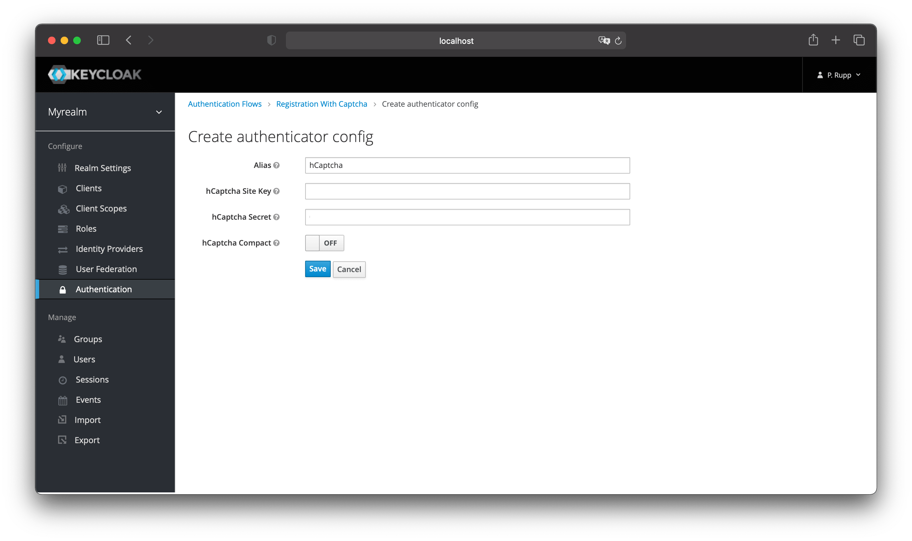
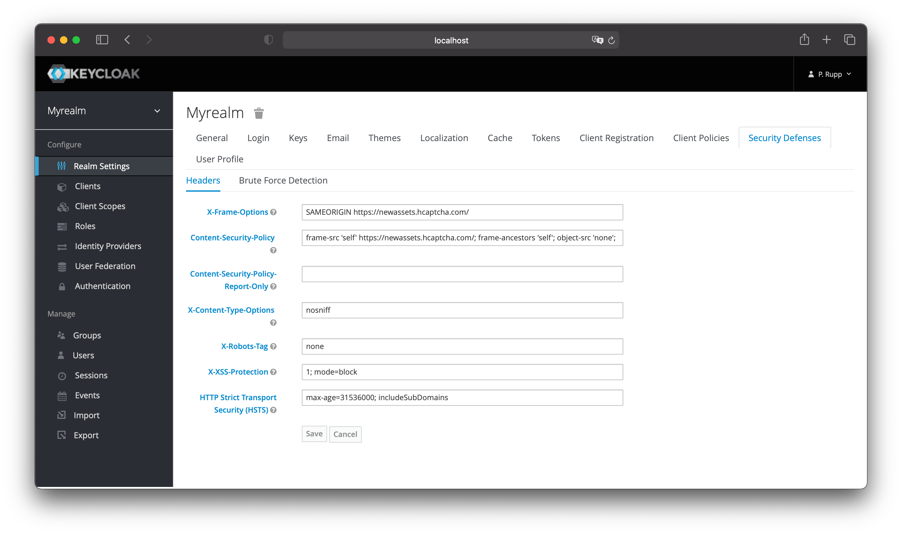
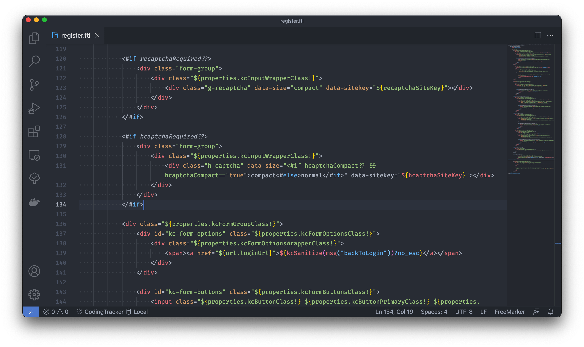
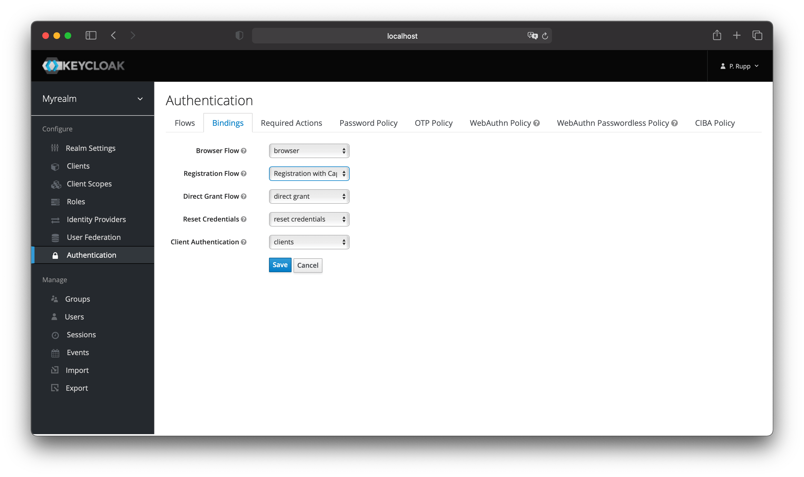

# keycloak-hcaptcha

To safeguard registration against bots, Keycloak has integration with Google reCAPTCHA. This provides similar functionality, but with a more privacy friendly provider named hCaptcha. The code is based on the vanilla implementation of reCAPTCHA in Keycloak.

## Installation

Download the newest release JAR (or comile it yourself) and drop it into `your_keycloak_installation/standalone/deployments`

There are a few steps you need to perform in the Keycloak Admin Console. Click the Authentication left menu item and go to the Flows tab. Select the Registration flow from the drop down list on this page.

Registration Flow

Make copy of the Registration flow, and add the hCaptcha execution to the Registration Form.

hCaptcha Registration Flow

Set the 'hCaptcha' requirement to Required by clicking the appropriate radio button. This will enable hCaptcha on the screen. Next, you have to enter in the hCaptcha site key and secret that you generated at the hCaptcha.com Website. Click on the 'Actions' button that is to the right of the hCaptcha flow entry, then "Config" link, and enter in the hCaptcha site key and secret on this config page.

hCaptcha Config Page


Now you have to do is to change some default HTTP response headers that Keycloak sets. Keycloak will prevent a website from including any login page within an iframe. This is to prevent clickjacking attacks. You need to authorize hCaptcha to use the registration page within an iframe. Go to the Realm Settings left menu item and then go to the Security Defenses tab. You will need to add https://newassets.hcaptcha.com to the values of both the X-Frame-Options and Content-Security-Policy headers.

Authorizing Iframes


To show the hCaptcha you need to modify the registration template. You can find the files in your Keycloak installation under `themes/base/login/`. If you use the user profile preview (you start your Keycloak with the `-Dkeycloak.profile=preview` flag), you need to edit the `register-user-profile.ftl`, else the `register.ftl`. Add the following code beneith the reCaptcha code:

```
<#if hcaptchaRequired??>
    <div class="form-group">
        <div class="${properties.kcInputWrapperClass!}">
            <div class="h-captcha" data-size="<#if hcaptchaCompact?? && hcaptchaCompact=="true">compact<#else>normal</#if>" data-sitekey="${hcaptchaSiteKey}"></div>
        </div>
    </div>
</#if>
```

Registration Template


In the last step you have to change the registration flow to the newly created one and save. Once you do this, the hCaptcha shows on the registration page and protects your site from bots!

Authentication Bindings


## © License
[MIT](LICENSE)
